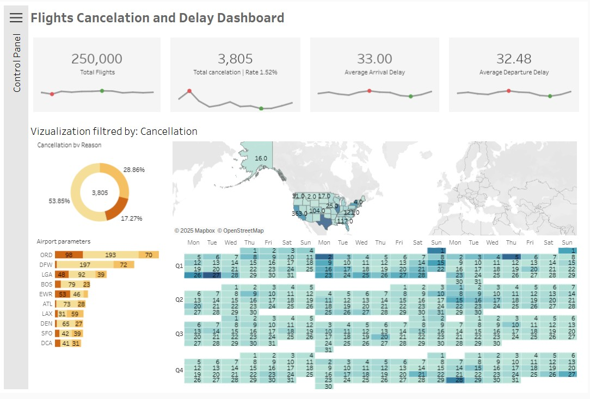

# ✈️ Flight Cancellation & Delay Analysis Dashboard

### 📊 Project Overview
This interactive Tableau dashboard allows airport managers and analysts to visualize flight patterns, identifying the root causes of cancellations and delays across major US airports. The goal was to build a tool that highlights peak delay times, seasonality, and carrier performance in a high-contrast environment.

**Key Features:**
* **Dark Mode UI:** Designed with a modern, high-contrast interface for better readability in low-light control room environments.
* **Interactive Control Panel:** Features a custom collapsible side menu (using Show/Hide containers) to filter by Airline, Airport, and Delay Class without cluttering the view.
* **Calendar Heatmap:** Visualizes daily cancellation intensity to identify seasonal trends and specific "bad days".
* **Geospatial Analysis:** Interactive map showing cancellation rates across states.

### 💾 Data Source & Optimization
The original dataset stems from the **US DOT Flight Delays** database (available on Kaggle with ~5 million records).

* **Optimization Strategy:** For this portfolio project, I utilized a **stratified sample of ~250,000 records** provided by the training program.
* **Why?** Working with this optimized subset ensures the dashboard remains high-performing and responsive on **Tableau Public**, focusing the project on Visualization techniques and UI/UX design rather than raw data processing latency.

### 🛠️ Technical Implementation (Tableau)
* **Advanced UX:** Collapsible containers for filters.
* **Parameters & Actions:** Dynamic switching between "Delay" and "Cancellation" metrics.
* **LOD Expressions:** Used for calculating average delay times per state relative to the national average.

---
*Created by Iurie Stratulat*
